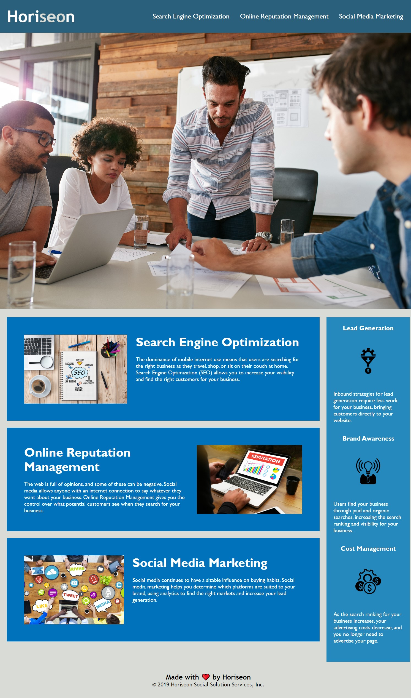

# hw1-challenge1-code-refactor

## Horiseon Website Refactor

## Description:

- I have gone in an refactored the HTML code to follow accesibilty standards so that the website is optimized for for search engines. I have edited the code without changing the websites original looks and functions.

## What has been changed:

- Checked to make sure all links were working
- Fixed links that were not working
- Added descriptions to the images so that they are not accessible
- Gave the code a descriptive title

## Screenshot of Website:

The following image shows the finised website:

### Deployed Website Link: https://dani-gore13.github.io/hw1-challenge1-code-refactor/#social-media-marketing
